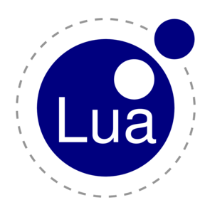
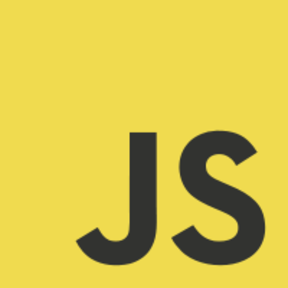
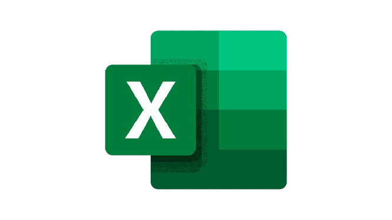

## Olá! Eu sou Bruno Antonello - Brunello Softwares 👋

- 🧑🏻‍💻 Técnico em Desenvolvimento de Sistemas - ETEC Prof. Armando Bayeux da Silva
- 🖥️ Graduando em Ciências da Computação - UNESP Rio Claro
- 🦅 Foco em Tecnologia e Desenvolvimento
- 🧩 Resolução de problemas do mundo real utilizando o mundo tecnológico
- 🛜 Gosto muito de IoT (Internet of Things - Internet das Coisas)

 

<!-- GitHub Stats -->

  
  

  
  <code></code>
  <code></code>
  <code></code>
  <code></code>
  <code></code>
  <code></code>
  <code></code>
  <code></code>
  <code></code>
  <code></code>
  <code></code>
  <code></code>
  <code></code>
  <code></code>
  <code></code>
  <code></code>

 

  

  

  

<!-- Snake Animation -->
<picture align="center">
  <source
    media="(prefers-color-scheme: dark)"
    srcset="https://raw.githubusercontent.com/Brunell0/Brunell0/output/github-contribution-grid-snake-dark.svg">

  <source
    media="(prefers-color-scheme: light)"
    srcset="https://raw.githubusercontent.com/Brunell0/Brunell0/output/github-contribution-grid-snake.svg">

  
</picture>

 
